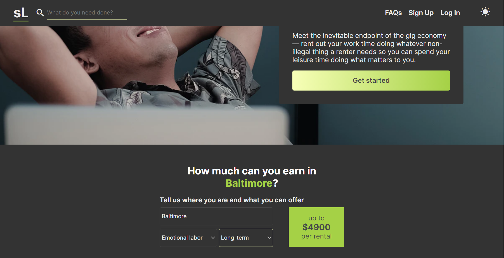

# selfLESS

A static mock landing page for a fictitious gig economy company. Features a clean, simple UI. Built completely in vanilla HTML, CSS, and JS.

  - Calculate income after user chooses a city, the type of provided labor, and length of the rental
  - Search bar featuring auto-completion for calculator with major cities of America
  - Toggle dark theme for night-time reading, designed with CSS custom properties
    - Both light and dark color schemes were designed with accessibility in mind

## Live Demo

[Try out the live demo of the project.](https://selfless.netlify.app/)

## Built With

  - HTML - Content structure
  - CSS - Custom properties, dark theme, content presentation
  - JS - General functionality